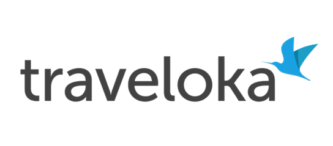

# Nama Resmi Perusahaan 

PT Trinusa Travelindo
Life, Your Way

# Identitas Murid

Hotbonar Maruli Tampubolon-12-10_TKJ_1

# Profil

Traveloka adalah Online Travel Agency (OTA) yang didirikan pada tahun 2012 oleh Ferry Unardi dan rekan-rekannya. Berawal sebagai platform pencari tiket pesawat dan hotel, Traveloka kini telah bertransformasi menjadi superapp perjalanan yang menawarkan layanan transportasi (bus, kereta api, sewa mobil), aktivitas wisata, asuransi perjalanan, hingga layanan keuangan.

# Visi

Menjadikan traveling lebih mudah, cepat, dan menyenangkan melalui teknologi. 
Menjadi salah satu perusahaan Biro Perjalanan Wisata (Agen Perjalanan) terbaik di Indonesia.
Berkontribusi dalam meningkatkan industri pariwisata  dan transportasi/perjalanan di Indonesia.

# Misi
Selalu menghadirkan produk-produk dan layanan terbaik.
Memberikan kemudahan dan kenyamanan bagi setiap pelanggan.
Secara terus-menerus meningkatkan kemampuan SDM dan infrastruktur perusahaan sehingga dapat memberikan pelayanan yang terbaik kepada seluruh pelanggannya.
Menjalin dan meningkatkan kerja sama dengan semua mitra usaha, baik domestik dan Internasional. 

# Produk/Layanan Utama

Transportasi
	Tiket pesawat, kereta, bus/travel, rental mobil hingga antar jemput bandara.
Akomodasi 
	Hotel dan penginapan.
Layanan keuangan
	TPayLater

# Logo Perusahaan 

# Alamat/Kontak 

Traveloka Campus (d/h Green Office Park 1) South Tower, lantai 2, zone 10. Jl. Grand Boulevard BSD Green Office Park, Sampora, Cisauk, Kab. Tangerang, Prov. Banten 15345
+62 21 30122077 (Indonesia)
cs@traveloka.com

# Daftar Sumber Refrensi 

https://id.timedoor.net/blogs/profil-traveloka-unicorn-indonesia/
https://www.traveloka.com/id-id/promotion/lifeyourway
https://www.scribd.com/document/590015823/About-Traveloka
https://www.traveloka.com/id-id
https://kumparan.com/berita-terkini/daftar-alamat-kantor-traveloka-di-beberapa-provinsi-di-indonesia-adakah-1yk6S9Icmii/3

# Pernyataan Integritas Akademik

Saya menyatakan bahwa riset dan kode ini dikerjakan oleh saya sendiri. AI hanya digunakan sebagai bantuan penjelasan konsep, 
menyusun kembali struktur informasi yang saya kumpulkan, dan bukan untuk menghasilkan jawaban akhir secara langsung.

# Link Website 

